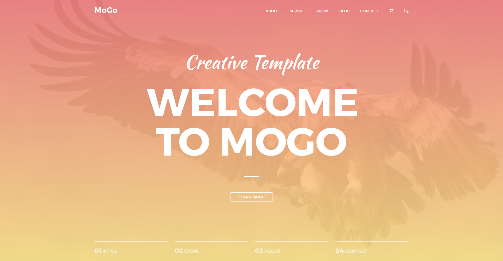

# MoGo template

Responsive Landing Page. [PSD source](https://freebiesbug.com/psd-freebies/mogo-free-one-page-psd-template/)

[Live preview](https://k4noise.github.io/MoGo/dist)

## How it work:

- for install depedencies type `npm install`
- for watch project in development mode type `npm run start`
- for build project type `npm run build`

## Technologies & instruments:

- PUG + HTML5
- BEM
- SASS + CSS3 + Autoprefixer
- Vanila JS + Babel
- Webpack

## Features:

- no third-party libraries
- hand-made animations
- adaptive for tablets and mobile devices
- using flexbox and grid technologies
- valid code